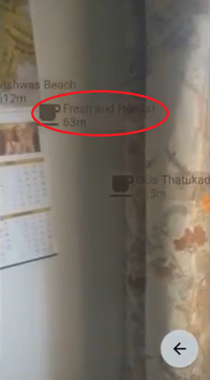
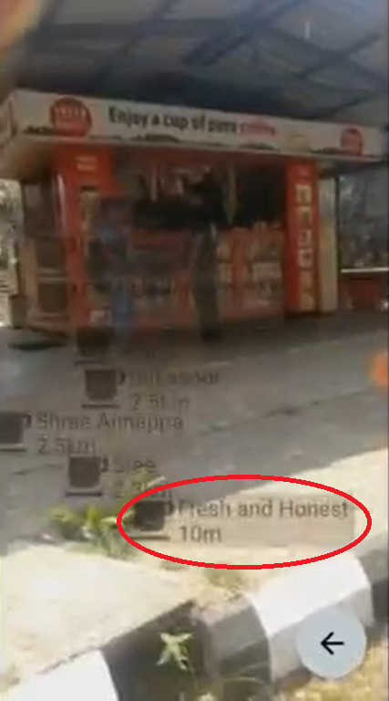
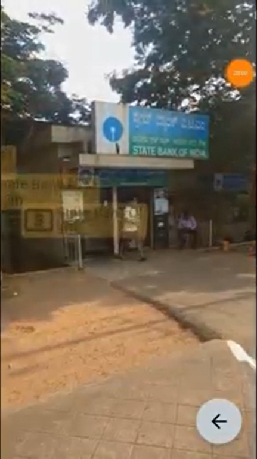

# ThirdEye
An augmented reality navigation and exploration Android application.

#### Overlay Display
CameraDisplayView opens the back facing camera's preview.

OverlayDisplayView draws the augmented reality overlay over the camera preview.

OverlayActivity updates both in real time as the device's **location** and **orientation** change.

#### Device Location and Orientation
1. Location is provided by Google Location API.
2. Orientation is a combination of accelerometer and magnetometer data fused and smoothed 
with a simple low pass filter to orient device in 3D space.

    * Heading is an azimuth to magnetic north, aligned to the back camera, changing as the device pans horizontally.
    * Pitch is aligned to portrait orientation, changing as the device is tilted vertically up or down.
    * Roll is aligned such that the device may pivot around the camera axis without throwing off the heading.

#### Nearby Locations
Nearby Locations queried from the Google Places API are tracked and 
displayed along the horizon when the camera is facing them. 
The user's bearing to and distance from each nearby location is calculated 
in real time as the device's location and orientation change.

#### Refine Search Activity
The user can modify the Places API search URL by toggling nearby cafes, 
bars, restaurants, parks, bookstores, art galleries, movie theatres, 
lodgings, grocery stores, ATMs, pharmacies, and transit stations.

#### Place Details Activity
Selecting a nearby location submits a query to the 
Google Places API for more information about that specific business and launches the Place Details screen. Image caching is handled by Glide and network request caching by Volley.

#### Permissions Activity
This screen is displayed upon initial launch and will persist until the user has allowed both Camera and Location permissions. If the user denies either and selects the "Do not ask again" option, the Permissions Activity will supply a direct link into Settings -> App Permissions -> Third Eye to allow the user to manually enable the required permissions.

#### Screenshots

